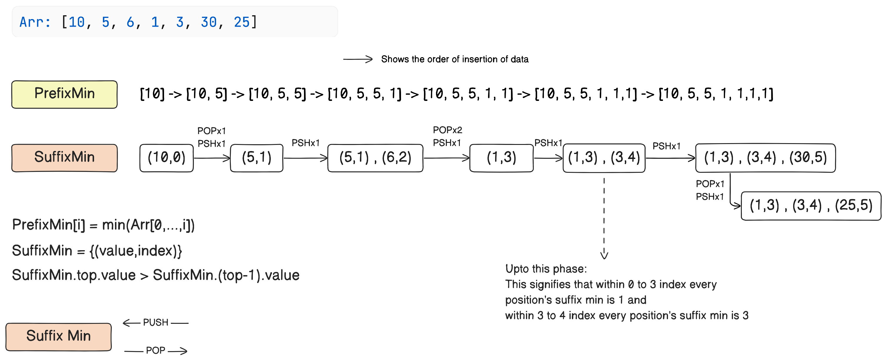
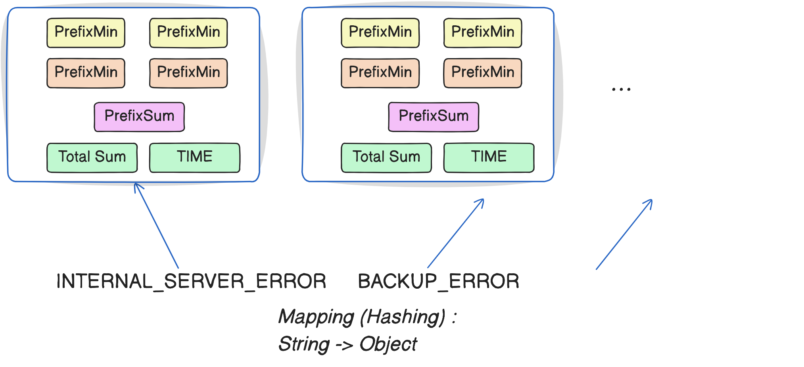

# Error Log Monitor System

## Overview

This repository contains the solution for the Curieo.org assignment, specifically an Error Log Monitor System implemented in Python 3.9.

## Prerequisites

- Python 3.9

## Setup Instructions

1. Clone the repository:
   ```sh
   git clone https://github.com/DEBASMITROY2002/Curieo_debasmit.git
   ```

2. Navigate to the repository folder:
   ```sh
   cd Curieo_debasmit
   ```
3. Create an 'input.txt' file in the repository folder to provide input data.

Sample input.txt Format
```
1715744138011;INTERNAL_SERVER_ERROR;23.72
1715744138012;INTERNAL_SERVER_ERROR;10.17
INTERNAL_SERVER_ERROR
1715744138012;BAD_REQUEST;15.22
1715744138013;INTERNAL_SERVER_ERROR;23.72
BEFORE 1715744138011
AFTER 1715744138010
BEFORE INTERNAL_SERVER_ERROR 1715744138011
AFTER INTERNAL_SERVER_ERROR 1715744138010
```

Note: Error types should not contain any non-alphanumeric characters except underscores. Ensure there are no extra whitespaces.


## Execution

To run the program, execute the following command:

   ```sh
   python3 run.py
   ```


#### Time complexity
If n is the total number of logs.

1. Time complexity for inserting each log into our data structure is 𝑂 ( 1 ) (amortized).
2. Time complexity for each query is 𝑂 ( log ⁡ 𝑛 ).


#### Space complexity
The order is : O(n)



#### Data Structures Used 

1. Prefix array for storing minimum, maximum, and summation  using python 1d list
2. Monotonic stack for suffix min/max using python 1d list
3. Map using python dictionary 


 ### Logic
1. Each log type is mapped to its associated log entry object using string-to-object mapping. Therefore, accessing log entries under each log type is done in  O(1)
2. Each log entry object contains prefix-suffix utilities, total severities, and timestamps in increasing order of timestamps.
3. Accessing timestamps using binary search requires  O(log n) time.
4. Each query over the prefix array requires O(1) time.
5. Each query over the Monotonic stack requires O(log n) using binary search.
6. The insertion of n elements into the monotonic stack takes O(n) time , resulting in O(1) time per element (amortized).
7. The Suffix mean is calculated using:  (Total Sum - Prefix Sum + Current Element) / (n-index)


